# Measure Me — User manual

Screens below were captured from the app running in the iOS Simulator with sample data and fictional demo charts (regenerate them with the **Screenshots** GitHub Actions workflow). The live camera screen uses a placeholder background, because the Simulator has no camera.

## 1. Before you start
- An iPhone with iOS 17 or later. The rear camera is recommended; LiDAR is used if your iPhone has it, but isn't required.
- Your height, measured barefoot against a wall. Every estimate is scaled from it.
- Fitted clothing, bare feet, long hair tied back.
- 2–3 m of clear space, a plain wall behind you and even light in front of you.
- A way to hold the phone upright at waist height: a tripod, something to lean it against, or a helper.
- A soft tape measure for measurements the camera can't take (underbust, wrist, ankle, rise).
- **Adults only (18+).**

## 2. First launch
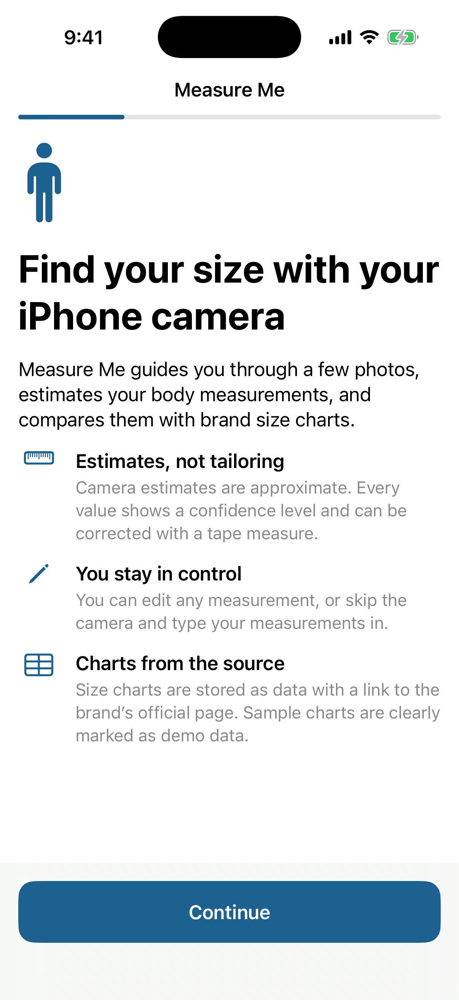 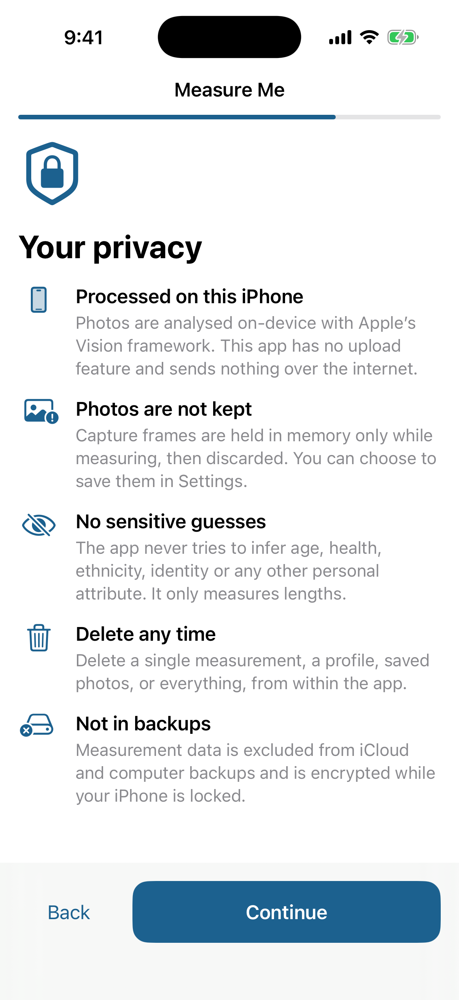 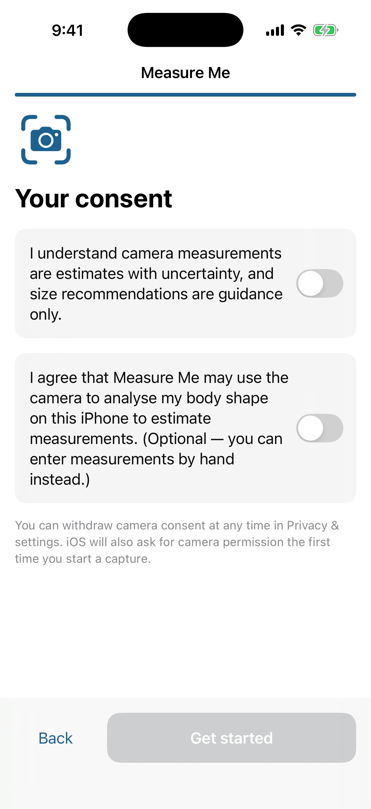

1. Read the welcome screen and tap **Continue**.
2. Confirm you are 18 or older.
3. Read the privacy summary: everything is processed on the iPhone, nothing is uploaded, photos are discarded, and nothing sensitive is inferred.
4. Confirm you understand that results are estimates (required).
5. Optionally consent to camera use. You can change this later in **Privacy & settings**.
6. Tap **Get started**.

## 3. Create a profile
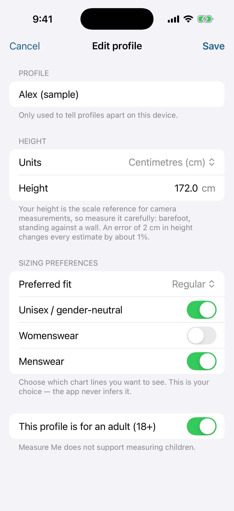 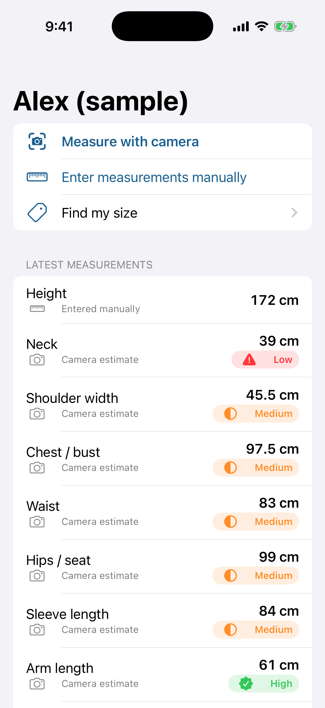

1. In **Profiles**, tap **+**.
2. Enter a nickname, units and height.
3. Choose your preferred fit and the chart lines you want to see.
4. Confirm the profile is for an adult, then tap **Save**.

The profile page gives you **Measure with camera**, **Enter measurements manually**, **Find my size**, your latest measurements with confidence badges, your history, and options to edit or delete the profile.

## 4. Measure with the camera
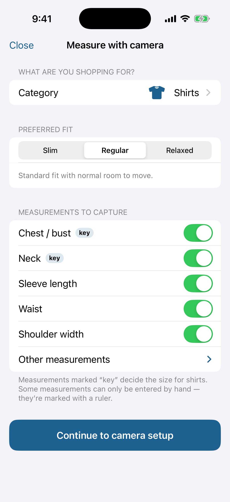 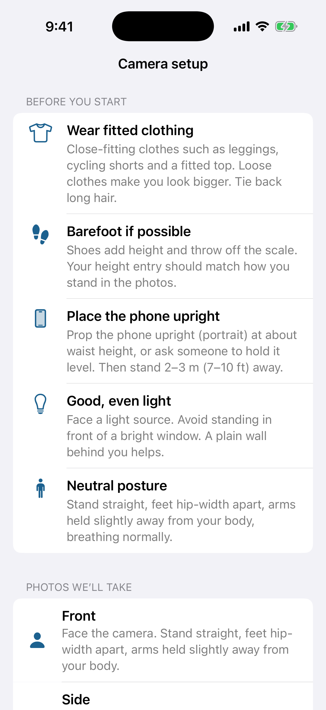 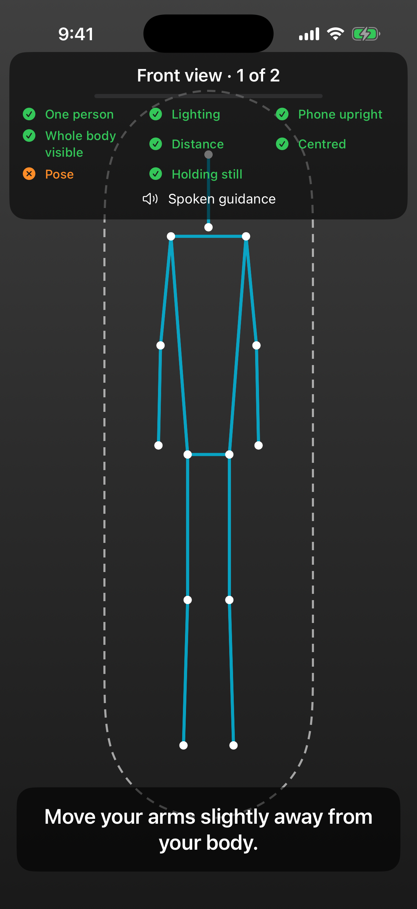

1. **Category:** pick what you're buying and the fit you want. Measurements marked *key* decide the size; a ruler icon means you'll enter that one by hand.
2. **Setup:** prop the phone upright at waist height, optionally add a back view, keep spoken guidance on, then tap **Start camera** and stand 2–3 m away.
3. **Capture:** follow the checklist and the spoken instruction.
   - Front: face the camera, feet hip-width apart, arms slightly away from your body.
   - Side: turn 90°, arms relaxed by your sides.

   When every check is green, a 3-2-1 countdown starts and the app takes a short burst. Hold still.
4. **Review:** check each photo, retake any view that looks wrong, then tap **Estimate measurements**.

## 5. Check your results
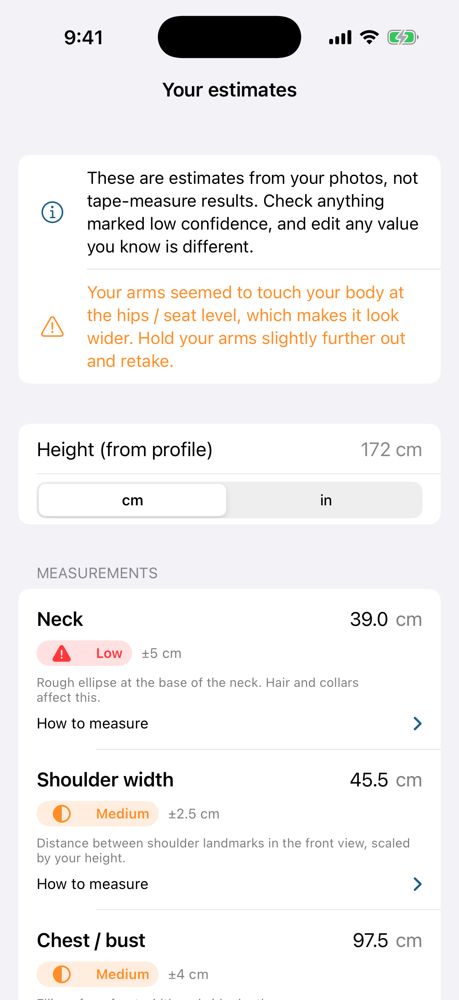

- Each value has a confidence badge (**High / Medium / Low**) and a ± range. *97.5 cm ±4 cm* means roughly 93.5–101.5 cm.
- **Not estimated** means the camera can't measure it reliably; type it in or leave it blank.
- Orange warnings describe problems with the photos, such as arms touching the body. Retaking usually helps.
- Tap a value to correct it. **Revert** restores the camera estimate, and **How to measure** gives tape instructions.
- Red values are outside the normal adult range (often a cm/inch mix-up) and must be fixed before you can **Save measurements**.

## 6. Enter measurements by hand
Open a profile, tap **Enter measurements manually**, choose the category, type each value (see **How to measure**), and tap **Save measurements**.

## 7. Find your size
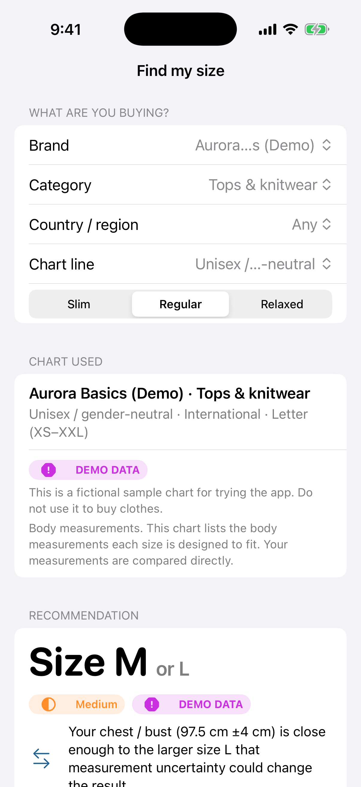

1. Choose brand, category, region, chart line, and optionally a size system or product. Then choose a fit.
2. Read the result:
   - the best size, plus a second size when the call is close, with the reason;
   - your values ± uncertainty next to each size range, with the measurements that drove the result in bold;
   - a **Why** explanation and the full chart.
3. **DEMO DATA** charts are fictional — don't buy clothes with them.
4. If the chart lacks what's needed, or you're missing a key measurement, the app asks for it instead of guessing.

## 8. History
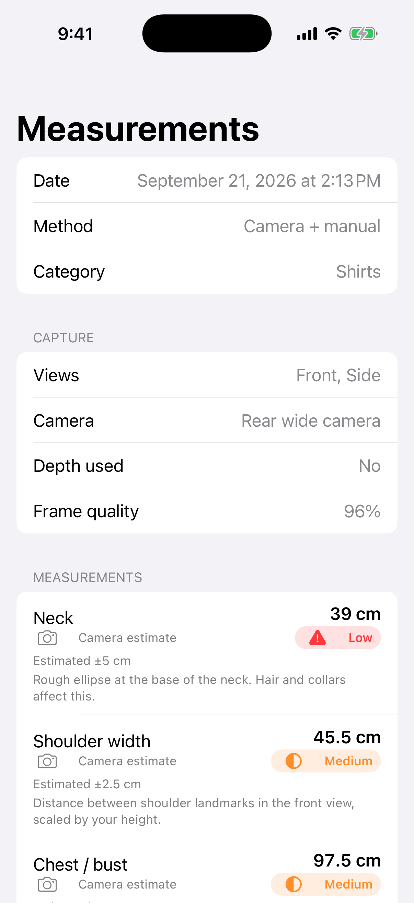

Tap a date under **History** to see how the session was captured and each value with its uncertainty. Edited values also show the original camera estimate. Delete a session, or just its saved photos, from there.

## 9. Size charts
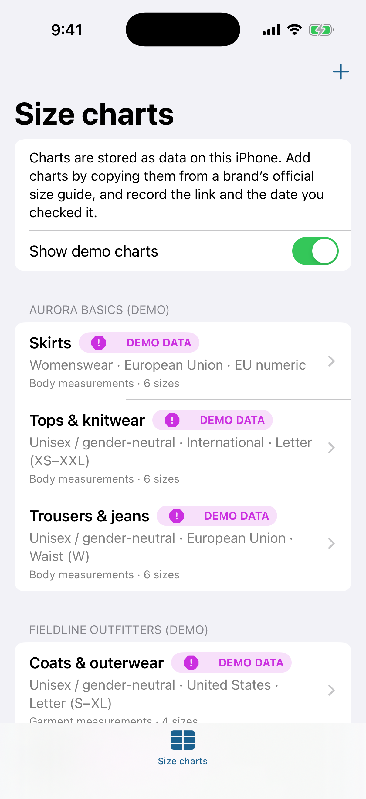 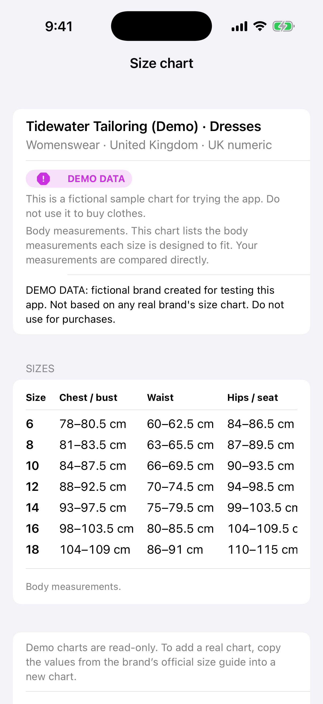 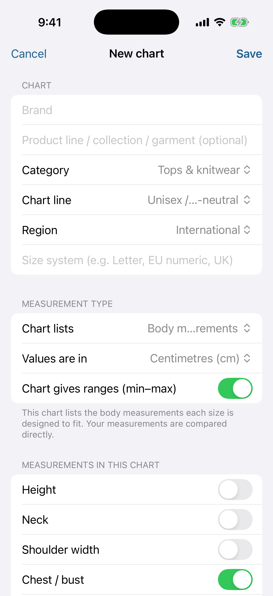

- **Browse:** charts are grouped by brand. You can hide the demo charts.
- **Add a real chart:** **+ › Add chart manually**. Copy the values exactly from the brand's official size guide, choose body or garment measurements, and add the guide's web address and the date you checked it (both required).
- **Keep charts current:** **Edit or update chart** and **Mark as re-verified today**.
- **Share charts:** **Import chart file (JSON)** / **Export my charts**. The format is in [SIZE_CHART_FORMAT.md](SIZE_CHART_FORMAT.md).

## 10. Privacy & settings
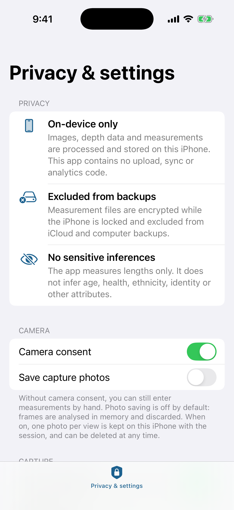

- Withdraw camera consent.
- Turn photo saving on or off (off by default).
- Set spoken guidance, default units and the LiDAR cross-check.
- View this iPhone's camera features and read **Accuracy and limitations**.
- Delete all saved photos, or **Delete all data**.

## 11. Troubleshooting
| What you see | What to do |
|---|---|
| Camera access is turned off | Tap **Open Settings** and allow the camera, or enter measurements manually |
| Countdown never starts | Fix the orange item in the checklist: usually distance, lighting or pose |
| Feet or head cut off | Step back, or lower the phone |
| "Turn further so your side faces the camera" | Rotate a full 90° |
| "Couldn't get a clear, steady frame" | Hold completely still; add light |
| Arms touched the body | Retake with arms a hand's width from your sides |
| Girths need a side view | Capture the side view; a single front photo can't measure chest, waist or hips |
| A value is red | Check the cm/inch unit |
| All estimates look off | Check the barefoot height in your profile |

Recommendations are guidance. For expensive or non-returnable items, confirm key measurements with a tape measure.
